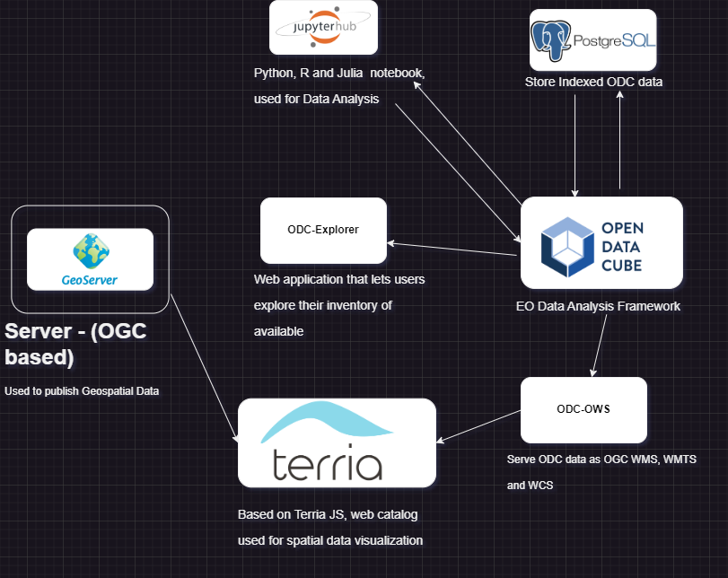

# Digital Earth South Africa - Open Datacube Instance




## 🧩DESA backend Components
- Explorer
- Jupyterhub  
- TerriaMap
- Open Web Services

## 🛠 Installation

1. **Clone the repository:**  
   ```sh
   https://github.com/Indiphile/SANSA-DESA.git
   ```
2. **Navigate to the project directory:**  
   ```sh
   cd desa-backend
   ```
3. **Pull, Build and Run DESA Backend components:**  
   ```sh
   docker compose up
   ```
## 🤝 Contributing

Contributions are welcome! Please fork the repository and submit a pull request.

## 📜 License

This project is licensed under the [MIT License](LICENSE).
